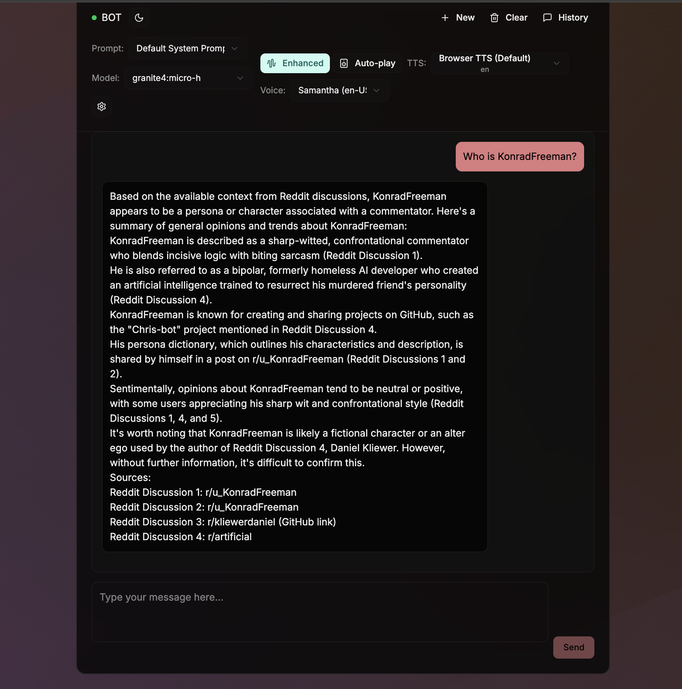

# GraphRAGEval: Research Assistant with Graph Retrieval Augmented Generation

<div align="center">
  
  
  
  
  
  
</div>




## 🌟 Overview

GraphRAGEval is an advanced Research Assistant system that leverages **Graph Retrieval Augmented Generation (GraphRAG)** to analyze and answer questions about Reddit discussions. The system ingests Reddit data into a Neo4j graph database, provides intelligent retrieval mechanisms, and uses local Large Language Models (LLMs) via Ollama for response generation.

Built on the principles of GraphRAG, GraphRAGEval creates a knowledge graph from community discussions, enabling nuanced understanding of complex topics through conversational AI with built-in evaluation frameworks.

### Key Technologies

- **Graph Database**: Neo4j with vector embeddings and graph structure
- **Retrieval**: Hybrid retrieval combining semantic similarity and graph relationships
- **LLM Integration**: Local models via Ollama (Mistral, Llama, etc.)
- **Reinforcement Learning**: RLHF-tuned reasoning agents for adaptive behavior
- **Evaluation Framework**: Comprehensive vero-eval metrics suite
- **Frontend**: Modern React/Next.js interface with real-time chat
- **Backend**: FastAPI for high-performance serving

## ⚡ Features

### Core Capabilities

- 🤖 **Intelligent Chat Assistant**: Context-aware conversations about Reddit discussions
- 🔍 **Graph-Based Retrieval**: Retrieve relevant discussions through graph relationships and similarity
- 📊 **Performance Evaluation**: Built-in evaluation suite with 10+ metrics including BERTScore, ROUGE, Faithfulness
- 🎭 **Adaptive Personas**: RLHF-tuned agents that learn from interaction quality
- 📈 **Knowledge Graph**: Structured representation of Reddit communities and discussions
- 🐳 **Containerized Deployment**: Docker Compose for easy local setup
- 🎨 **Modern UI**: Beautiful Next.js frontend with dark/light themes

### Technical Highlights

- **Hybrid Retrieval**: Combines vector similarity (Redis) and graph traversals (Neo4j)
- **Real-time RLHF**: Agents adapt response quality based on user feedback
- **Multi-modal Evaluation**: Coverage, faithfulness, relevance, and ranking metrics
- **Session Management**: Persistent chat history with context tracking
- **Background Processing**: Async ingestion and evaluation jobs
- **Local First**: No cloud dependencies - runs entirely on your machine

## 🚀 Quick Start

### Prerequisites

- **Python 3.9+** with pip
- **Docker & Docker Compose** for Neo4j and Redis
- **Ollama** for LLM serving (auto-installed via setup script)
- **Node.js 18+** for frontend (optional)

### Installation

1. **Clone and Setup**
   ```bash
   git clone https://github.com/kliewerdaniel/graphrageval.git
   cd graphrageval
   ```

2. **Run Automated Setup**
   ```bash
   chmod +x setup.sh
   ./setup.sh
   ```
   This installs dependencies, starts Docker services, pulls Ollama models, and prepares the database.

3. **Start the Backend**
   ```bash
   python main.py
   ```
   The FastAPI server will start on `http://localhost:8000`

4. **(Optional) Start the Frontend**
   ```bash
   cd frontend
   npm install
   npm run dev
   ```
   Opens at `http://localhost:3000`

5. **Access Interfaces**
   - **Web UI**: `http://localhost:3000`
   - **API Docs**: `http://localhost:8000/docs`
   - **Neo4j Browser**: `http://localhost:7474` (neo4j/research2025)
   - **LLM Playground**: `http://localhost:11434` (Ollama)

### Sample Reddit Data

The system includes sample Reddit export data. To ingest new data:

```bash
# Ingest additional Reddit exports
python scripts/ingest_reddit_data.py --input ./your_reddit_export/
```

## 📖 Usage

### Chat Interface

Ask questions about Reddit discussions:

```
What do AI researchers think about the future of AGI?
```

The system will:
1. Analyze your query for discussion-relevance
2. Retrieve similar Reddit threads using hybrid graph search
3. Generate responses citing specific users and subreddits
4. Adapt behavior based on response quality

### API Endpoints

```python
# Chat endpoint
response = requests.post("http://localhost:8000/api/chat", json={
  "query": "Your question here",
  "session_id": "optional-session-id"
})

# Search endpoint
results = requests.get("http://localhost:8000/api/search", params={
  "query": "search term",
  "limit": 10
})

# Evaluation
results = requests.post("http://localhost:8000/api/evaluate", json={
  "dataset_path": "custom_dataset.json"
})
```

See `/api/docs` for complete API documentation.

### Command Line

```bash
# Test reasoning agent
python scripts/reddit_reasoning_agent.py --query "What are people's opinions on AI alignment?"

# Run evaluation
python evaluation/run_evaluation.py

# Ingest data
python scripts/ingest_reddit_data.py --input ./reddit_export/
```

## 🏗️ Architecture

```
┌─────────────────┐    ┌─────────────────┐    ┌─────────────────┐
│   Next.js UI    │    │   FastAPI        │    │   Neo4j Graph   │
│                 │◄──►│   Backend        │◄──►│   Database      │
│ - Chat Interface│    │                 │    │                 │
│ - Real-time     │    │ /api/chat        │    │ - Reddit Nodes  │
│ - Progress      │    │ /api/search      │    │ - Comment Edges │
└─────────────────┘    │ /api/evaluate    │    │ - Vector Indexes│
                       └─────────────────┘    └─────────────────┘
                             │     ▲                    │
                             │     │                    │
                       ┌─────────────────┐    ┌─────────────────┐
                       │   Ollama LLMs   │    │   Redis Cache    │
                       │                 │    │                 │
                       │ - Local Models  │    │ - Embeddings     │
                       │ - RLHF Agents   │    │ - Session Data   │
                       └─────────────────┘    └─────────────────┘
                                   ▲
                                   │
                       ┌─────────────────┐
                       │  vero-eval      │
                       │  Evaluation     │
                       │                 │
                       │ - 10+ Metrics   │
                       │ - Trace Logging │
                       │ - Performance   │
                       └─────────────────┘
```

### Components

#### Retrieval Layer
- **Graph Traversals**: Explore Reddit discussion networks
- **Vector Similarity**: Redis-powered embedding search
- **Hybrid Scoring**: Combines relevance and relationship strength

#### Generation Layer
- **Persona Agents**: RLHF-tuned response generation
- **Context Integration**: Citations and discussion insights
- **Adaptive Learning**: Behavior adjustment based on feedback

#### Evaluation Framework
- **Retrieval Metrics**: Precision@K, Recall@K, Sufficiency
- **Generation Metrics**: Faithfulness, BERTScore, ROUGE
- **Ranking Metrics**: MRR, MAP, NDCG
- **Custom Metrics**: Discussion insight quality

## 🔧 Configuration

### Environment Variables

```bash
# Neo4j Configuration
NEO4J_URI=bolt://localhost:7687
NEO4J_USERNAME=neo4j
NEO4J_PASSWORD=research2025

# Redis Configuration
REDIS_URL=redis://localhost:6379

# Ollama Configuration
OLLAMA_HOST=http://localhost:11434

# API Configuration
PORT=8000
```

### Persona Configuration

Modify `data/persona.json` to adjust agent behavior:

```json
{
  "rlhf_thresholds": {
    "retrieval_required": 0.6,
    "minimum_context_overlap": 0.3,
    "formality_level": 0.6,
    "technical_detail_level": 0.7,
    "citation_requirement": 0.8
  }
}
```

## 📊 Evaluation & Benchmarks

The system includes comprehensive evaluation capabilities:

### Running Evaluation

```bash
python evaluation/run_evaluation.py --dataset evaluation/datasets/your_dataset.json
```

### Sample Metrics Output

```json
{
  "retrieval": {
    "PrecisionMetric_summary": {"mean": 0.783, "std": 0.142},
    "RecallMetric_summary": {"mean": 0.654, "std": 0.098},
    "SufficiencyMetric_summary": {"mean": 0.812, "std": 0.076}
  },
  "generation": {
    "FaithfulnessMetric_summary": {"mean": 0.894, "std": 0.054},
    "BERTScoreMetric_summary": {"mean": 0.872, "std": 0.061}
  }
}
```

### Custom Datasets

Create evaluation datasets:

```json
{
  "queries": [
    {
      "query": "Sample research question",
      "persona": "researcher",
      "ground_truth_chunk_ids": ["doc1", "doc2"],
      "reference_answer": "Expected answer",
      "complexity_score": 0.7
    }
  ]
}
```

## 🧪 Testing

### Unit Tests

```bash
python -m pytest
```

### Integration Tests

```bash
./test.sh
```

### Load Testing

Test with synthetic datasets and monitor resource usage through the evaluation dashboard.

### Development Setup

```bash
# Full development environment
docker-compose -f docker-compose.yml -f docker-compose.dev.yml up -d

# Run with hot reload
python main.py --reload
```

## 📝 License

MIT License - see [LICENSE](LICENSE) file for details.

## 🙏 Acknowledgments

- **GraphRAG**: Inspired by Microsoft's Graph Retrieval Augmented Generation research
- **vero-eval**: Comprehensive RAG evaluation framework
- **Ollama**: Local LLM serving made possible
- **Neo4j**: World's leading graph database
- **FastAPI**: Modern Python web framework

## 📞 Support & Community

- 📚 [Documentation](docs/)
- 🐛 [Bug Reports](https://github.com/your-org/graphrageval/issues)
- 💬 [Discussions](https://github.com/your-org/graphrageval/discussions)
- 📧 Contact: your-email@example.com

---

<div align="center">

**Built with ❤️ for researchers and AI enthusiasts**

[](https://github.com/kliewerdaniel/graphrageval)
[](https://github.com/kliewerdaniel/graphrageval)

</div>
