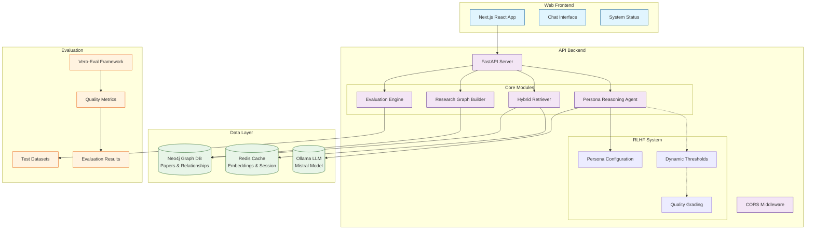

# GraphRAG Research Assistant

[](https://opensource.org/licenses/MIT)
[](https://www.python.org/downloads/)
[](https://nextjs.org/)
[](https://neo4j.com/)
[](https://github.com/vero-labs-ai/vero-eval)

An advanced **Graph Retrieval-Augmented Generation (GraphRAG)** system for academic research assistance. Combines graph database relationships, local LLM inference, and reinforcement learning from human feedback (RLHF) to provide contextually aware, factually accurate responses to research queries.

## ✨ Key Features

- **🕸️ Graph-Powered RAG**: Neo4j graph database enables structural understanding of research relationships, concepts, and citations
- **🧠 Persona-Based Reasoning**: Dynamic personas with RLHF optimization adapt response style and quality thresholds
- **🔍 Hybrid Retrieval**: Combines vector embeddings (nomic-embed-text) with graph traversal for superior context retrieval
- **💾 Local LLM Inference**: Ollama integration ensures privacy and offline capability with models like Mistral
- **📊 Comprehensive Evaluation**: Built-in vero-eval framework for automated quality assessment and benchmarking
- **🌐 Modern Web Interface**: Next.js 16 frontend with real-time chat and research paper visualization
- **⚡ Production Ready**: FastAPI backend with Redis caching, Docker orchestration, and scalable architecture
- **🔧 Extensible Design**: Modular architecture supports custom retrievers, personas, and evaluation metrics

## 🏗️ Architecture



## 📋 Prerequisites

- **Python 3.9+** with pip
- **Node.js 18+** and npm
- **Docker & Docker Compose** (for database services)
- **[Ollama](https://ollama.ai/)** for local LLM inference
- **4GB+ RAM** recommended

### 🔧 System Requirements

| Component | Minimum | Recommended |
|-----------|---------|-------------|
| RAM | 4GB | 8GB+ |
| Storage | 10GB | 50GB+ |
| CPU | 2 cores | 4+ cores |

## 🚀 Quick Start

1. **Clone and setup**:
   ```bash
   git clone https://github.com/kliewerdaniel/GraphRAGEval
   cd GraphRAGEval   ```

2. **One-command setup and start**:
   ```bash
   ./start.sh
   ```
   This will:
   - Install dependencies
   - Start Neo4j and Redis via Docker
   - Pull required Ollama models
   - Set up database schema
   - Start FastAPI backend and Next.js frontend
   - Run initial evaluation

3. **Open your browser**: [http://localhost:3000](http://localhost:3000)

4. **Ask research questions** through the chat interface!

## 📦 Installation

### Option 1: Automated Setup (Recommended)

```bash
# Complete automated setup
./setup.sh

# Start all services
./start.sh
```

### Option 2: Manual Installation

1. **Backend Setup**:
   ```bash
   # Create virtual environment
   python3 -m venv venv
   source venv/bin/activate

   # Install Python dependencies
   pip install -r requirements.txt
   ```

2. **Frontend Setup**:
   ```bash
   cd frontend
   npm install
   npm run build
   cd ..
   ```

3. **Services Setup**:
   ```bash
   # Start databases
   docker-compose up -d

   # Pull LLM models
   ollama pull mistral
   ollama pull nomic-embed-text
   ```

4. **Database Schema**:
   ```bash
   # Set up Neo4j indexes
   python3 scripts/ingest_research_data.py --setup-indexes
   ```

## 💬 Usage

### Basic Usage

**Via Web Interface**:
- Navigate to [http://localhost:3000](http://localhost:3000)
- Enter research queries in the chat interface
- View sources, relevance scores, and retrieval methods

**Via API**:
```bash
# Health check
curl http://localhost:8000/api/health

# Chat endpoint
curl -X POST http://localhost:8000/api/chat \
  -H "Content-Type: application/json" \
  -d '{"query": "What are the main approaches to attention mechanisms in deep learning?", "chat_history": []}'

# Search papers
curl http://localhost:8000/api/search?query=transformer%20models&limit=5

# System status
curl http://localhost:8000/api/status
```

**Via Python Script**:
```python
from scripts.reasoning_agent import PersonaReasoningAgent

agent = PersonaReasoningAgent()
result = agent.generate_response("Explain the transformer architecture")

print(f"Response: {result['response']}")
print(f"Quality Score: {result['quality_grade']}")
print(f"Sources: {len(result['context_used'])} papers")
```

### Advanced Features

#### Adding Research Papers

```bash
# Copy PDFs to data directory
cp your_papers/*.pdf data/research_papers/

# Ingest into graph database
python3 scripts/ingest_research_data.py --directory data/research_papers
```

#### Running Evaluations

```bash
# Evaluate with default test set
python3 evaluation/run_evaluation.py

# Evaluate with custom dataset
python3 evaluation/run_evaluation.py \
  --dataset evaluation/datasets/your_custom_dataset.json \
  --output evaluation/results/custom_eval.json

# Generate new test dataset
python3 evaluation/generate_test_dataset.py \
  --queries 100 \
  --include-stress-tests \
  --output evaluation/datasets/stress_test_v1.json
```

#### Custom Persona Configuration

Edit `data/persona.json`:
```json
{
  "name": "Expert Researcher",
  "rlhf_thresholds": {
    "retrieval_required": 0.8,
    "citation_requirement": 0.9,
    "formality_level": 0.8,
    "technical_detail_level": 0.9
  }
}
```

## ⚙️ Configuration

### Environment Variables

Create a `.env` file or set environment variables:

```bash
# Database
NEO4J_URI=bolt://localhost:7687
NEO4J_USERNAME=neo4j
NEO4J_PASSWORD=research2025

# Caching
REDIS_URL=redis://localhost:6379

# LLM
OLLAMA_BASE_URL=http://localhost:11434
OLLAMA_MODEL=mistral

# API
PORT=8000
CORS_ORIGINS=http://localhost:3000,http://127.0.0.1:3000

# Logging
LOG_LEVEL=INFO
```

### Customizing Retrieval

Modify `scripts/hybrid_retriever.py` to adjust:
- Vector similarity thresholds
- Graph traversal depth
- Weighted combination of retrieval methods
- Caching strategies

## 📡 API Documentation

### Endpoints

#### Core Endpoints

- `GET /api/health` - Health check
- `POST /api/chat` - Main chat interface with GraphRAG
- `GET /api/search` - Direct paper search
- `POST /api/ingest` - Background paper ingestion
- `POST /api/evaluate` - Run evaluation suite

#### System Management

- `GET /api/status` - Comprehensive system status
- `GET /api/evaluation-results` - Latest evaluation metrics

### Request/Response Examples

**Chat Request**:
```json
{
  "query": "How do BERT models handle contextual embeddings?",
  "chat_history": [
    {"role": "user", "content": "Explain transformer models"},
    {"role": "assistant", "content": "Transformers use self-attention..."}
  ],
  "persona_override": null
}
```

**Chat Response**:
```json
{
  "response": "BERT (Bidirectional Encoder Representations from Transformers) handles contextual embeddings through its bidirectional training approach...",
  "context_used": [...],
  "quality_grade": 0.87,
  "retrieval_method": "hybrid",
  "retrieval_performed": true,
  "sources": [...]
}
```

## 🛠️ Development

### Project Structure

```
graphRAGvero01/
├── main.py                    # FastAPI application entry point
├── scripts/
│   ├── reasoning_agent.py     # Core RLHF-enabled reasoning agent
│   ├── hybrid_retriever.py    # Graph + vector retrieval logic
│   ├── graph_schema.py        # Neo4j graph schema definitions
│   └── ingest_research_data.py # PDF ingestion pipeline
├── frontend/                  # Next.js React application
│   ├── src/
│   │   ├── app/              # Next.js 13+ app router
│   │   ├── components/       # React components
│   │   └── styles/           # CSS styles
│   ├── package.json
│   └── next.config.ts
├── evaluation/                # Vero-eval testing framework
│   ├── run_evaluation.py     # Main evaluation runner
│   ├── metrics.py            # Quality assessment metrics
│   ├── generate_test_dataset.py # Synthetic test data generation
│   └── datasets/             # Pre-defined test datasets
├── data/                     # Research papers and configuration
│   ├── research_papers/      # PDF storage
│   ├── persona.json         # RLHF persona configuration
│   └── sample_papers/       # Sample datasets
├── docker-compose.yml        # Multi-service orchestration
├── requirements.txt          # Python dependencies
├── setup.sh                  # Automated setup script
└── start.sh                  # Complete startup script
```

### Running Tests

```bash
# Backend tests
python3 -m pytest

# Frontend tests
cd frontend
npm test

# End-to-end evaluation
python3 evaluation/run_evaluation.py --comprehensive
```

### Adding New Features

1. **Custom Retriever**: Extend `scripts/hybrid_retriever.py`
2. **New Persona**: Update `data/persona.json`
3. **UI Components**: Add to `frontend/src/components/`
4. **API Endpoints**: Modify `main.py`

### Debugging

- **View Neo4j Browser**: [http://localhost:7474](http://localhost:7474)
- **Check API Logs**: Backend logs in terminal
- **System Status**: GET `/api/status`

## 📊 Evaluation Framework

### Metrics

- **Retrieval Quality**: Precision, Recall, F1-Score, MAP
- **Response Quality**: Factual accuracy, Completeness, Citation quality
- **System Performance**: Latency, Throughput, Memory usage
- **RLHF Scores**: Persona effectiveness, Adaptation rate

### Running Benchmarks

```bash
# Full evaluation suite
python3 evaluation/run_evaluation.py \
  --dataset evaluation/datasets/research_assistant_v1.json \
  --metrics accuracy,latency,relevance

# Stress testing
python3 evaluation/run_evaluation.py \
  --dataset evaluation/datasets/stress_tests.json \
  --concurrent-requests 10
```

## 📄 License

This project is licensed under the MIT License - see the [LICENSE](LICENSE) file for details.

## 🙏 Acknowledgments

- **[Neo4j](https://neo4j.com/)** for the powerful graph database platform
- **[Ollama](https://ollama.ai/)** for local LLM inference
- **[Vero-Eval](https://github.com/vero-labs-ai/vero-eval)** for the evaluation framework
- **[Mistral AI](https://mistral.ai/)** for the Mistral language model
- **[Next.js](https://nextjs.org/)** for the excellent React framework


---

**Built with ❤️ by the Research Assistant Team**

*Transforming research discovery through intelligent graph-based retrieval and generation*
